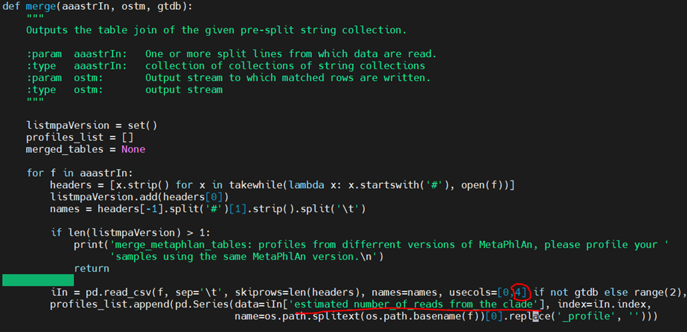
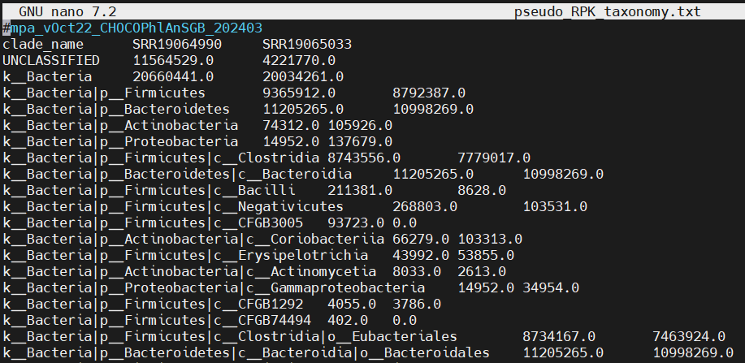

# **Background**

MetaPhlAn was developed by the Huttenhower lab and is designed to taxonomically
annotate metagenomic reads.

Compute Canada has [specific
instructions](https://docs.alliancecan.ca/wiki/MetaPhlAn) for downloading
MetaPhlAn reference databases. While they’re a good starting point, the
instructions must be modified, especially if you’re on a server such as Beluga
that can’t access the internet on its compute nodes. If the Compute Canada
instructions are followed, MetaPhlAn won’t have all of the necessary database
files and will try to download the missing ones from the internet, which breaks
the code.

This protocol is based on
[MetaPhlAn4](https://github.com/biobakery/MetaPhlAn/wiki/MetaPhlAn-4) (the
current version). It consists of the official Compute Canada instructions that
have been tweaked to make it run with no errors.

## Recommended Clusters

This protocol will work best on clusters whose job nodes have internet access,
but others should also work perfectly as long as the databases are properly
installed.

# **Installing MetaPhlAn and Dependencies**

Reference databases are necessary to annotate the taxa.

Download the databases into a dedicated folder in your scratch folder. This
ensures that they can be properly accessed by the compute nodes once the job has
been submitted.

This downloads the current versions as of Sept 2024 – [check
here](http://cmprod1.cibio.unitn.it/biobakery4/metaphlan_databases/?C=M;O=D) to
ensure that you’re downloading the most recent versions.

```{bash, eval=FALSE, warning=FALSE, include=T, results='hide'}
cd $SCRATCH
mkdir metaphlan_databases
cd metaphlan_databases

# Download the MetaPhlAn databases
# Also download the Bowtie2 index database (CRITICAL)
parallel wget ::: http://cmprod1.cibio.unitn.it/biobakery4/metaphlan_databases/mpa_vOct22_CHOCOPhlAnSGB_202403.tar http://cmprod1.cibio.unitn.it/biobakery4/metaphlan_databases/mpa_vOct22_CHOCOPhlAnSGB_202403_marker_info.txt.bz2 http://cmprod1.cibio.unitn.it/biobakery4/metaphlan_databases/mpa_vOct22_CHOCOPhlAnSGB_202403_species.txt.bz2 http://cmprod1.cibio.unitn.it/biobakery4/metaphlan_databases/bowtie2_indexes/mpa_vOct22_CHOCOPhlAnSGB_202403_bt2.tar
```

The files will then be extracted to finish the installation. As this is
computationally expensive, an interactive job is started beforehand (line 1).

Line 1: remember the account has to be def-bfinlay (or your Compute Canada
sponsor), not your own account.

```{bash, eval=FALSE, warning=FALSE, include=T, results='hide'}
salloc --account=def-bfinlay --cpus-per-task=5 --mem=10G
parallel tar -xf ::: *.tar # Unzip both .tar files
parallel bunzip2 ::: *.bz2 # unzip both .bz2 files
```

Cancel the rest of your resource allocation once it’s done in order to free up
the resources.

```{bash, eval=FALSE, warning=FALSE, include=T, results='hide'}
# Change armetcal for your username
squeue -u armetcal # This prints your active jobs
```

```{bash, eval=FALSE, warning=FALSE, include=T, results='hide'}
scancel job-ID # Add the job ID listed in the squeue output
```

Lastly, create a new environment called **metaphlan_virenv** where all of the
MetaPhlAn4 dependencies can be initialized. We will then install Compute
Canada's MetaPhlAn module into it. **If this step has been done previously, it
can be skipped.**

```{bash, eval=FALSE, warning=FALSE, include=T, results='hide'}
cd $SCRATCH

# Generate a virtual environment
virtualenv --no-download metaphlan_virenv/env
source metaphlan_virenv/env/bin/activate

# Install metaphlan and its dependencies
pip install --no-index --upgrade pip
pip install --no-index metaphlan==4.1.1  # Edit as needed

# Deactivate the environment
deactivate
```

## Troubleshooting Installation

There are a number of error messages you may encounter. Inspect the slurm output
file (nano slurm-jobID.out) to identify the specific error. When things go wrong
with MetaPhlAn, there tend to be many error messages in the output, but they are
often caused by just one or two root issues.

-   **“Disk quota exceeded”** - MetaPhlAn requires a lot of disk space. If
    you’ve installed more than one or two other programs in your account, then
    you might run out of space.

    -   See this page for troubleshooting:
        <https://docs.alliancecan.ca/wiki/Frequently_Asked_Questions#Disk_quota_exceeded_error_on_/project_filesystems>

    -   If you run the steps under “How to fix the problem” and are still
        encountering the error, try the following:

        -   Make sure you’re changing def-professor to your professor’s account
            name (i.e. def-bfinlay). \$USER automatically refers to you and
            shouldn’t be changed.

        -   If lfs find \~/projects/\*/ -group \$USER fails, just skip it and go
            to the next line.

        -   The steps worked, but your code still fails due to the disk quota:
            look at **diskusage_report** again (from the web link). Are you over
            your space or file allocations, especially in your home or scratch
            directories? If so, you’ll need to delete some files (old unused
            programs, etc) in order to make room for the new installations.

-   **“Failed to build image”** – it’s unable to finish installing everything.
    Check whether you’re over your storage quota (see the previous
    troubleshooting point), and check whether your version of Python is
    incompatible with the packages (if so, there should be an error message near
    the top of the slurm output file).

# **Prep Data: Concatenate Reads**

If reads are separated into forward and reverse reads, MetaPhlAn4 only uses the
forward reads. We will therefore concatenate the forward and reverse reads into
a single file and store these in a 'concatenated' folder.

Note that the following simply pastes the reverse reads after the forward reads.
Some tools require that the reads are 'interleaved' (i.e. paired reads remain
next to each other), but this is not necessary here.

It is computationally expensive, so we will submit a job. Start a new script in
the project directory by entering `nano run_concat.sh`. In the script, paste the
following and then hit Ctrl+S and Ctrl+X to save and exit. Note that the time is
designed for only four read files (two samples). Run the script using
`sbatch run_concat.sh`.

```{bash, eval=FALSE, warning=FALSE, include=T, results='hide'}
#!/bin/bash

#SBATCH --account=def-bfinlay
#SBATCH --time=00:15:00
#SBATCH --cpus-per-task=10
#SBATCH --mem=15G

# Store concatenated reads here
mkdir sequences/concatenated

# Concatenate
ls hocort_out/*_1.fastq.gz | sed 's/hocort_out\///; s/_1.fastq.gz//' | parallel 'zcat hocort_out/{}_1.fastq.gz hocort_out/{}_2.fastq.gz | gzip > sequences/concatenated/{}.fastq.gz'
```

# **Run MetaPhlAn**

### Background

The MetaPhlAn module is available on Compute Canada, and so does not need to be
separately installed (aside from the databases downloaded above). First check
what the most up-to-date version of MetaPhlAn is by typing
`avail_wheels metaphlan --all-versions`. Currently the most recent version is
4.1.1. This will be inputted into the script below.

Start a new script in the project directory by entering
`nano run_metaphlan4.sh`. In the script, paste the script below, and then hit
Ctrl+S and Ctrl+X to save and exit. Note that the time is designed for only four
read files (two samples). Run the script using `sbatch run_metaphlan4.sh`.

Note: **EDIT THE FILE PATHS AS NEEDED.**

### Additional Notes

There are many settings for metaphlan - check the official documentation for
more information. Here we use the following parameters:

-   **--input_type fastq**: Input is in fastq format.

-   **--unclassified_estimation**: tells how many reads were not matched to a
    taxon.

-   **-o metaphlan_out/{}.txt**: Taxonomic annotations will be saved in this
    folder in txt format.

-   **--nproc 14**: use nearly all the processing power available.

-   **-t rel_ab_w_read_stats**: Note that **no metagenomic annotation is
    perfectly analogous to 16S counts**. However, setting -t (analysis type) to
    rel_ab_w_read_stats will give you **pseudo-RPK values**, which can be fed
    into many tools that rely on counts. (differential abundance etc, but be
    careful with diversity metrics). MetaPhlAn by default gives relative
    abundance values, so the pseudo-RPK values are created by multiplying rel ab
    by total read count.

-   **--index mpa_vOct22_CHOCOPhlAnSGB_202403:** MetaPhlAn4 databases,
    downloaded above

-   **--bowtie2db \$SCRATCH/metaphlan_databases:** location of the databases,
    downloaded above

-   **--bowtie2out metaphlan_out/bt_out/{}.bowtie2.bz2:** Save the intermediate
    step output (reannotation, if necessary, will be almost instant)

### Code

If you see memory or time errors in the slurm log file after the code runs,
increase the relevant requests accordingly, remove any files that were generated
during the failed run, and resubmmit the job.

```{bash, eval=FALSE, warning=FALSE, include=T, results='hide'}
#!/bin/bash

#SBATCH --account=def-bfinlay
#SBATCH --time=00:30:00
#SBATCH --cpus-per-task=15
#SBATCH --mem=30G

date
# Move to the scratch
cd $SCRATCH

# Activate the virtual environment
source metaphlan_virenv/env/bin/activate

# Move to your working directory
cd path/from/scratch

# Initialize save directories
mkdir metaphlan_out
mkdir metaphlan_out/bt_out # This saves files from an intermediate step

# Load the required modules
# Note: update python version as required. If it’s not the correct version, you will probably see it in the slurm output file.
module load gcc blast samtools bedtools bowtie2 python/3.11

# Get all file names with their paths, then run MetaPhlAn4
# unclass estimation tells us how many reads weren't mapped to a specific taxon
# o is the save location and name
# nproc tells the code to use all the processing power available
date
ls sequences/concatenated/*.fastq.gz | \
sed 's/sequences\/concatenated\///; s/.fastq.gz//' | \
parallel metaphlan sequences/concatenated/{}.fastq.gz \
--input_type fastq \
--unclassified_estimation \
-o metaphlan_out/{}.txt \
--nproc 14 \
-t rel_ab_w_read_stats \
--index mpa_vOct22_CHOCOPhlAnSGB_202403 \
--bowtie2db $SCRATCH/metaphlan_databases \
--bowtie2out metaphlan_out/bt_out/{}.bowtie2.bz2
date
```

# **Format the Results**

MetaPhlAn4 outputs one text file for each sample; however, it comes with a
function that can concatenate the results into a single table. Notably, the
function will only save the relative abundance values, not the pseudo-RPK values
which are required for many downstream analyses. We will therefore generate two
results tables: one with relative abundance, and one using a modified version of
the concatenate command that will use the pseudo-RPK values. Note that the
modified command can ONLY be run if `-t` was set to `rel_ab_w_read_stats` in the
`metaphlan` command.

### Modify the Command

If you have previously run this step, you do not need to run it again.

Firstly, make a copy of the merge_metaphlan_tables.py script. This can be done
by copying the version in your_virtual_environment/env/bin, or by downloading a
fresh version from GitHub. The python script can be stored anywhere (but you
will need to call the location when running the code).

Below: download a fresh version to the scratch folder, and then add
“\_pseudoRPK” on the end so that we can remember what the script is for.

```{bash, eval=FALSE, warning=FALSE, include=T, results='hide'}
cd $SCRATCH
# Download the command
wget https://raw.githubusercontent.com/biobakery/MetaPhlAn/master/metaphlan/utils/merge_metaphlan_tables.py
# Rename it
mv merge_metaphlan_tables.py merge_metaphlan_tables_pseudoRPK.py
```

Then open up the script using `nano merge_metaphlan_tables_pseudoRPK.py` and
make two changes:

-   Change a **2** to a **4** (red circle, below). This specifies the data
    column from the individual txt files.

-   Change **relative_abundance** to
    **estimated_number_of_reads_from_the_clade** (underlined).

Then save and close the modified script (Ctrl+S, Ctrl+X).

{width="514"}

### Run the Commands

We will re-activate the metaphlan_virenv environment and then run the commands.
Note that because the modified command is not part of the installed metaphlan
package, a few additional specifications need to be added to allow it to work
properly.

Run the following directly in the console (no job submission is needed).
Alternatively, if the modified function was created previously, this can be
merged with the `run_metaphlan.sh` script:

```{bash, eval=FALSE, warning=FALSE, include=T, results='hide'}
cd $SCRATCH

# Activate the virtual environment
source metaphlan_virenv/env/bin/activate

# Move to your working directory
cd test_pipe2

# Create a new folder that will store all annotations
#mkdir annotations

# Load the required modules
# Note: update python version as required. If it’s not the correct version, you will probably see it in the slurm output file.
module load gcc blast samtools bedtools bowtie2 python/3.11

# RELATIVE ABUNDANCE TABLE
merge_metaphlan_tables.py metaphlan_out/*.txt > annotations/rel_abundance_taxonomy.txt

# PSEUDO RPK TABLE
python $SCRATCH/merge_metaphlan_tables_pseudoRPK.py metaphlan_out/*.txt > annotations/pseudo_RPK_taxonomy.txt
```

In the output, there will be one row serving as a title. The second row and
beyond show the taxonomy info in the left column and each sample as a subsequent
column, where the column names match the original file names.

The values in the output tables should match up exactly with the individual .txt
files - use `nano` to inspect the files if desired.

Here is an example of the delimited text file using pseudo RPK values:


