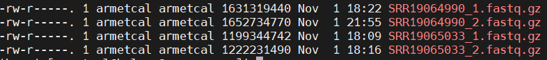

# **Background**

Now that we've gone through each step individually, we will put all of the steps
together and process two paired-end samples. We will assume that all
installations and downloads other than our reads are complete.

We will download two random samples from Wallen et. al's 2022 paper,
"Metagenomics of Parkinson’s disease implicates the gut microbiome in multiple
disease mechanisms".

The steps covered will include:

1.  [Download reads from two
    samples](https://armetcal.github.io/Bioinformatic-Tool-Wikipedia/download_reads/index.html)
2.  [Check the initial quality using
    FastQC](https://armetcal.github.io/Bioinformatic-Tool-Wikipedia/read_filtering/fastqc.html)
3.  [Trim and filter reads for quality using
    BBDuk](https://armetcal.github.io/Bioinformatic-Tool-Wikipedia/read_filtering/bbduk.html)
4.  [Remove human reads using
    HoCoRT](https://armetcal.github.io/Bioinformatic-Tool-Wikipedia/read_filtering/hocort.html)
5.  [Check the final quality using
    FastQC](https://armetcal.github.io/Bioinformatic-Tool-Wikipedia/read_filtering/fastqc.html)

# **Step 1: Download Reads**

We will use Method 1 - the ENA Browser.

Note that the project accession is PRJNA834801, but we will only download two
reads for this example. This will take anywhere from 4 minutes to an hour
depending on download location, internet speed, and file size. Ensure that your
computer does not disconnect from the server while the code is running.

## Preparation

The accession was searched on the ENA browser and all FTP download commands were
downloaded as explained in the tutorial linked above. The wget commands for two
random samples, SRR19065033 and SRR19064990, were isolated.

## 1a. Run Code

```{bash, eval=FALSE, warning=FALSE, include=T, results='hide'}
# This will be our working directory
mkdir scratch/test_pipe2
# This is where raw sequences will be downloaded
mkdir scratch/test_pipe2/sequences
# Go to the sequences directory
cd scratch/test_pipe2/sequences

wget -nc ftp://ftp.sra.ebi.ac.uk/vol1/fastq/SRR190/033/SRR19065033/SRR19065033_1.fastq.gz
wget -nc ftp://ftp.sra.ebi.ac.uk/vol1/fastq/SRR190/033/SRR19065033/SRR19065033_2.fastq.gz

wget -nc ftp://ftp.sra.ebi.ac.uk/vol1/fastq/SRR190/090/SRR19064990/SRR19064990_1.fastq.gz
wget -nc ftp://ftp.sra.ebi.ac.uk/vol1/fastq/SRR190/090/SRR19064990/SRR19064990_2.fastq.gz
```

## 1b. Outputs

Inspecting our sequences folder using ls -l \*, we see that four fastq.gz files
have been downloaded, with each one being 1.2-1.6 GB. (Because the reads are
split into forward/reverse when downloaded, the combined size is larger than the
actual download.)



# **Step 2: Check Quality**

## 2a. Run Code

First we return to our project directory, then open a new script:

```{bash, eval=FALSE, warning=FALSE, include=T, results='hide'}
# Return to the project main folder
cd ..
# Make the new folder and initialize a script
nano run_fastqc.sh
```

In the script, paste the following and then hit Ctrl+S and Ctrl+X to save and
exit. Note that the time is designed for only four read files (two samples).

```{bash, eval=FALSE, warning=FALSE, include=T, results='hide'}
#!/bin/bash

#SBATCH --account=def-bfinlay   # Change bfinlay to your professor's username
#SBATCH --time=00:15:00      # Adjust time as needed
#SBATCH --cpus-per-task=10
#SBATCH --mem=15G 

# Make the folder that will store all fastqc outputs
# This folder will also be used when we run fastqc at the end.
mkdir fastqc_out

# Load FastQC and its dependencies - update versions as needed.
module load StdEnv/2023 fastqc/0.12.1
# Run FastQC on all read files
parallel fastqc --outdir=fastqc_out ::: sequences/*.fastq.gz
```

Then run the script using `sbatch run_fastqc.sh`.

## 2b. Outputs

In our fastqc_out folder, two files are generated for each input file. One is an
HTML page summarizing the quality metrics, and the other is a zip file
containing all the images within the HTML file.

The HTML files can be downloaded from Compute Canada using the Globus online
tool and opened in your browser. **Both samples fail certain tests and have
warnings in others.**

Both samples fail the **Per Base Sequence Content** test. This artifact is
common in sequencing libraries when observed in the beginning of the read.
Notably, this is a technical bias, but trimming is not recommended as they still
represent real DNA and trimming does not seem to improve read quality (see [this
link](https://www.bioinformatics.babraham.ac.uk/projects/fastqc/Help/3%20Analysis%20Modules/4%20Per%20Base%20Sequence%20Content.html)
for more info).

{width="446"}

Both samples have warnings in **Sequence Duplication Levels**, meaning that
non-unique sequences make up \>20% of the total reads. Ideally, most reads
should have no duplication (left side of the plot). These may be contaminants
such as primers, adapters, etc, or might point to PCR overamplification when
prepping the library. See [this
link](https://www.bioinformatics.babraham.ac.uk/projects/fastqc/Help/3%20Analysis%20Modules/8%20Duplicate%20Sequences.html)
for more info.

{width="435"}

Sample 1 (SRR19065033) also shows a warning for **GC content** - it is not as
normal as expected. However, the deviation is somewhat minor. Spikes may
indicate the presence of specific contaminants, but no spikes are apparent
here. See [this
link](https://www.bioinformatics.babraham.ac.uk/projects/fastqc/Help/3%20Analysis%20Modules/5%20Per%20Sequence%20GC%20Content.html)
for more info.

{width="431"}

Sample 2 shows a warning for **Adapter Content**. Notably, it identifies the
type of adapter detected: the Nextera Transposase Sequence adapter. This matches
the adapters described in the Wallen et. al paper. See [this
link](https://www.bioinformatics.babraham.ac.uk/projects/fastqc/Help/3%20Analysis%20Modules/10%20Adapter%20Content.html)
for more info.

{width="426"}

Overall, the QC has only demonstrated the necessity of several filtering steps
that are part of the regular pipeline (ex. adapter trimming). No other problems
with the library are apparent.

# **Step 3: Trim and Filter**

## 3a. Run Code

Start a new script in the project directory by entering `nano run_bbduk.sh`. In
the script, paste the following and then hit Ctrl+S and Ctrl+X to save and exit.
Note that the time is designed for only four read files (two samples). Run the
script using `sbatch run_bbduk.sh`.

```{bash, eval=FALSE, warning=FALSE, include=T, results='hide'}
#!/bin/bash

#SBATCH --account=def-bfinlay   # Change bfinlay to your professor's username
#SBATCH --time=01:00:00     
#SBATCH --cpus-per-task=20
#SBATCH --mem=50G 

# Load the dependencies
module load StdEnv/2023 bbmap/39.06 java/21.0.1

# Make the output directories
mkdir bbduk_out
mkdir bbduk_out/stats

# Allow overwrite of default memory usage
unset JAVA_TOOL_OPTIONS

# Trim and filter, all in one step
# First we read in all the unique sequencing file names, then pull out 
# the sample names, and then read them through our bbduk.sh pipeline.
# {sample} acts as a placeholder for the sample names.
for file in sequences/*_1.fastq.gz; do
  sample=$(basename "$file" "_1.fastq.gz")  # Extracts the sample name
  bbduk.sh \
    in=sequences/"${sample}_1.fastq.gz" \
    in2=sequences/"${sample}_2.fastq.gz" \
    out=bbduk_out/"${sample}_1.fastq.gz" \
    out2=bbduk_out/"${sample}_2.fastq.gz" \
    stats=bbduk_out/stats/"${sample}_stats.txt" \
    tpe tbo qtrim=rl trimq=25 maq=25 minlen=50 ref=adapters,phix \
    entropy=0.01 \
    -Xmx45g
done
```

### Important: check for success

Because output files are initialized and then continuously modified as the code
runs, it is not possible to tell from the files that the run was successful.
**The first thing we should inspect is therefore the run log.** Compute Canada
jobs schedule jobs using 'slurm' software, meaning that every script submitted
will generate a slurm file of the format **slurm-jobID.out**, where jobID is an
8 digit number. Recent jobs will have bigger numbers.

When we inspect the slurm file using `nano slurm-jobID.out`, we should see a
complete print out for **each** of the samples. First we see information about
the function, then the amount of memory available, the recognition of paired-end
reads, the processing time, and finally a summary of everything that was
filtered out. For both samples, \~25% of the reads and \~1/3 of the bases were
removed. In the bbduk_out folder, the output files should be roughly
proportionally smaller than the raw read inputs. This can be printed to screen
using `ls -l *.fastq.gz`.

{width="562"}

It is very common for BBDuk to fail because of inadequate memory. If this
happens, **you will not see a red summary for every sample; instead, the output
will abruptly stop. In addition, a stats file will not be generated for the
affected sample.** An example is shown below in yellow: here it reports an
**oom_kill** event, or 'out of memory' kill event where the job is terminated
due to inadequate memory allocation. Simply increase the amount of memory
requested in the job (`#SBATCH --mem=50G`) and/or the bbduk function
(`-Xmx45g`). The function memory should always be slightly less than the job
memory.

{width="558"}

#### Order of Operations

1.  Check slurm output: `nano slurm-jobID.out`

    1.  Check that there are no obvious errors, most samples have red summaries

2.  Check the number of fastq and stats output files: `ls -1 | wc -l`

    1.  Paired-end reads: should be **equal number of input and output fastq
        files, 2x as many output fastq files as stats files**

    2.  Remember to subtract any other files from counts (slurm files, etc)

3.  If there are fewer stats files:

    1.  Recheck slurm file to see if samples are failing due to inadequate
        memory. If so, increase `--mem=50G` and `-Xmx45g`.

    2.  Otherwise, run following **one piece at a time**:

```{bash, eval=FALSE, warning=FALSE, include=T, results='hide'}
# In bbduk_out folder:

# List sample IDs from the FASTQ files
fastq_samples=$(ls *_1.fastq.gz | sed 's|.*/||; s/_1.fastq.gz//')
# List sample IDs from the stats files
stats_samples=$(ls stats/*_stats.txt 2>/dev/null | sed 's|.*/||; s/_stats.txt//')

# Compare the lists to find sample IDs in FASTQ but not in stats
comm -23 <(echo "$fastq_samples" | sort) <(echo "$stats_samples" | sort) > missing_stats_samples.txt

# Create a copy of the bbduk script, but run this instead of the for...done loop 
# Then recheck the outputs as described above
while read -r sample; do
bbduk.sh \
in=sequences/"${sample}_1.fastq.gz" \
in2=sequences/"${sample}_2.fastq.gz" \
out=bbduk_out/"${sample}_1.fastq.gz" \
out2=bbduk_out/"${sample}_2.fastq.gz" \
stats=bbduk_out/stats/"${sample}_stats.txt" \
tpe tbo qtrim=rl trimq=25 maq=25 minlen=50 ref=adapters,phix \
entropy=0.01 \
-Xmx45g
done < missing_stats_samples.txt

#If the samples still aren't working, there was likely an error when the samples were originally downloaded.
# Delete the raw fastq files that correspond to the failed samples, redownload just the failed samples, and then rerun bbduk using the copy of the bbduk script (so that bbduk is only rerun on the failed samples).
```

## 3b. Outputs

There are two main outputs. The first are the filtered and trimmed files; as
described above, these files will be smaller than the raw read inputs in a
manner that is roughly proportional to the amount of data removed.

Secondly, each file in the `stats` subfolder contains a summary of the sequences
that were filtered out of the reads. The sequences were specified by the `-ref`
command in the `bbduk.sh` function. In this case, we filtered out PhiX
contaminant sequences and adapters. The stats file tells us that 3.8% of the
data were filtered out, with the vast majority of the reads matching the adapter
sequences described in the paper's Methods section.

{width="471"}

# **Step 4: Remove Human Reads**

Before this step, basic installation of the HoCoRT dependencies should be
completed as described in the [HoCoRT
tutorial](https://armetcal.github.io/Bioinformatic-Tool-Wikipedia/read_filtering/hocort.html).

1.  **The HoCoRT environment** should be created. If it is anywhere else in the
    Compute Canada account, it should still be accessible within your working
    directory without copying the environment files over. **In other words, if
    you have previously built the `hocort` environment, no further steps need to
    be taken.**
2.  **Human reference genome:** this should be downloaded and the index should
    be built. Only the index folder (which contains the half-dozen index files)
    is necessary to run the tool. **If the index folder is already present
    elsewhere (and if it is still up to date), the entire folder can be copied
    to the current working directory using
    `cp -r path/to/index path/to/workingdirectory`.**
    1.  **The following assumes that the index folder is present in the working
        directory.**

## 4a. Run Code

Start a new script in the project directory by entering `nano run_hocort.sh`. In
the script, paste the following and then hit Ctrl+S and Ctrl+X to save and exit.
Note that the time is designed for only four read files (two samples). Run the
script using `sbatch run_hocort.sh`.

```{bash, eval=FALSE, warning=FALSE, include=T, results='hide'}
#!/bin/bash

#SBATCH --account=def-bfinlay   # Change bfinlay to your professor's username
#SBATCH --time=01:00:00      # Adjust time as needed
#SBATCH --cpus-per-task=40
#SBATCH --mem=90G

# Make the output directory
mkdir hocort_out

# Activate the hocort environment
source activate hocort

# Run tool on paired-end, adapter-trimmed sequences
# -x gives the index (compiled in Stage 1)
# For paired sequences, give 2 inputs and 2 outputs
# --filter true will give us anything that doesn't match the index (all non-human reads in this case)
# --threads=37 allows the use of almost all of the 40 CPUs requested in the job.
for file in bbduk_out/*_1.fastq.gz; do
  sample=$(basename "$file" "_1.fastq.gz")  # Extracts the sample name
  hocort map bowtie2 \
    -x $SCRATCH/test_pipe2/index/human.index \
    -i bbduk_out/"${sample}_1.fastq.gz" bbduk_out/"${sample}_2.fastq.gz" \
    -o hocort_out/"${sample}_1.fastq.gz" hocort_out/"${sample}_2.fastq.gz" \
    --filter true
    --threads=37
done
```

## 4b. Outputs

The HoCoRT function only outputs filtered fastq.gz files. In order to see what
was filtered, we can inspect the slurm log file (described in the *Important:
check for success* section). Upon inspection with `nano slurm-jobID.out`, we
observe the following printout for each sample:

{width="565"}

As with Step 3, if you observe a memory or 'out of time' error, increase the
memory and/or time requests at the top of the script as required.

In the above screenshot, the vast majority of reads did not align with the
reference genome. Only 0.01% (1/10,000) of reads were detectably of human
origin. These reads were filtered out of the output fastq.gz files. The low
number is because these samples were auto-filtered to remove human reads when
the raw files were uploaded to the online repository (described in the paper's
supplementary information).

Note that the output files are slightly larger than the inputs; this is simply
because the fastq files were re-zipped by HoCoRT using a different format and is
not a cause for concern.

# **Step 5: Check Quality**

We will assess the quality of the cleaned reads and compare the quality to the
raw reads.

## 5a. Run Code

Start a new script in the project directory by entering
`nano run_fastqc_clean.sh`. In the script, paste the following and then hit
Ctrl+S and Ctrl+X to save and exit. Note that the time is designed for only four
read files (two samples). Run the script using `sbatch run_fastqc_clean.sh`.

```{bash, eval=FALSE, warning=FALSE, include=T, results='hide'}
#!/bin/bash  

#SBATCH --account=def-bfinlay   # Change bfinlay to your professor's username #SBATCH --time=00:15:00      # Adjust time as needed 
#SBATCH --cpus-per-task=10 

mkdir fastqc_out/clean  
# Load FastQC and its dependencies - update versions as needed
module load StdEnv/2023 fastqc/0.12.1 

# Run FastQC on all read files 
parallel fastqc --outdir=fastqc_out/clean ::: hocort_out/*.fastq.gz
```

Then run the script using `sbatch run_fastqc_clean.sh`.

## 5b. Outputs

Most metrics should be improved. If failures remain, check the [FastQC
documentation](https://www.bioinformatics.babraham.ac.uk/projects/fastqc/) to
determine the source of the issue and whether any additional steps need to be
added to the pipeline.

# **Next Step**

At this point, the reads are considered 'clean' and can be annotated.

Taxonomic annotation can be performed using
[MetaPhlAn.](https://armetcal.github.io/Bioinformatic-Tool-Wikipedia/Annotation/)
