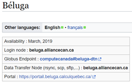
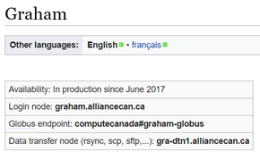

# Download FastQ Reads to Compute Canada

## Choosing a compute cluster

Compute Canada has a variety of clusters to choose from, all with varying
parameters. Parameters include internet access on the computational nodes, the
amount of resources that can be requested, etc.

**Dowloading reads can take a very long time**, depending on the files, and
therefore it is often convenient to [submit a
job](https://docs.alliancecan.ca/wiki/Running_jobs) rather than perform the
download interactively (line by line in the console).

Different clusters have different ways they want you to download data. For
Beluga, we can see from [the
wiki](https://docs.alliancecan.ca/wiki/B%C3%A9luga/en) that they want us to use
the login (default) node to download files, as the node name is the same. This
means that you must log in and download files interactively without requesting
any computational resources.



Whereas for Graham, the node is different. Be sure to check that you are using
the correct nodes for your cluster:



**This protocol will be most convenient to run on clusters whose job nodes have
internet access, such as Cedar** – otherwise you will have to run the commands
interactively (without a .sh script) or use a different workaround. **This
protocol was troubleshot on Beluga**, which doesn’t have internet access.
**Graham** is not a good choice as the job nodes don’t have internet access, but
the RAM available in the login nodes is inadequate.

**You can easily transfer data between clusters using the Globus utility tool**,
so if your downstream tools are installed on a cluster without internet access,
it may be worth downloading the files on Cedar etc. using a script and then
transferring them afterward. That way your computer doesn’t have to stay
connected to the server for the entire download.

## Recommended Method: SRA Toolkit

This method works for all file sizes, does not require new installations, and is
reasonably fast.

You will need the project accession number of your desired reads. Note that the
sra-toolkit version may differ over time/clusters - run
`module spider sra-toolkit` to see the available versions.

```{bash, eval=FALSE, warning=FALSE, include=T, results='hide'}
# Files will save to this location
cd scratch/path/to/sequences

# Accession
project="PRJNA433459" # 80 samples

# Load the SRA Toolkit
module load sra-toolkit/3.0.9

# Make a list of all fastq files associated with the project, save the file accessions to a list (SRR.numbers), and download them.
esearch -db sra -query $project | efetch -format runinfo > runinfo.csv
cat runinfo.csv | cut -d "," -f 1 > SRR.numbers
cat SRR.numbers | parallel fastq-dump --split-files --origfmt --gzip {}
```

Check that you have the correct number of files afterward by running
`ls -1 /path/to/directory | wc -l`. It seems to skip files quite often for some
reason. Remember that there will be **two files for each sample** (forward and
reverse reads).

If it doesn’t download all the files, create a filtered version of SRR.numbers
and rerun the command on the missing samples:

```{bash, eval=FALSE, warning=FALSE, include=T, results='hide'}
# List of successful files
ls *.fastq.gz | sed 's/_.*//g' | sort | uniq > existing_accession_codes.txt
# Filter the original list to include accessions that aren't in the above list
grep -v -F -f existing_accession_codes.txt SRR.numbers > filtered_accession_list.txt
# Then rerun the code
module load sra-toolkit/3.0.9 # This must be run every time CC restarts
cat filtered_accession_list.txt | parallel fastq-dump --split-files --origfmt --gzip {}
```

### **Optional: Move forward reads into a separate folder**

Many programs (such as MetaPhlAn) only use the forward reads, and so it is often
convenient to divide the reads into separate folders.

```{bash, eval=FALSE, warning=FALSE, include=T, results='hide'}
# Navigate to your sequences folder
cd scratch/path/to/sequences

# Create forward and reverse directories
mkdir fwd_reads
mkdir rev_reads

# Bin the reads
mv *_1.fastq.gz fwd_reads
mv *_2.fastq.gz rev_reads
```
