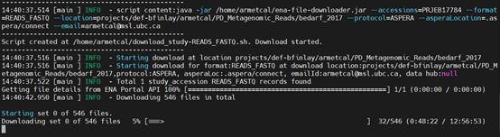

## Choosing a compute cluster

Compute Canada has a variety of clusters to choose from, all with varying
parameters. Parameters include internet access on the computational nodes, the
amount of resources that can be requested, etc.

**Dowloading reads can take a very long time**, depending on the files, and
therefore it is often convenient to [submit a
job](https://docs.alliancecan.ca/wiki/Running_jobs) rather than perform the
download interactively (line by line in the console).

Different clusters have different ways they want you to download data. For
Beluga, we can see from [the
wiki](https://docs.alliancecan.ca/wiki/B%C3%A9luga/en) that they want us to use
the login (default) node to download files, as the node name is the same. This
means that you must log in and download files interactively without requesting
any computational resources. **If using login nodes, do NOT run more than two
parallel processes at a time!**


Whereas for Graham, the node is different. Be sure to check that you are using
the correct nodes for your cluster:


**This protocol will be most convenient to run on clusters whose job nodes have
internet access, such as Cedar** – otherwise you will have to run the commands
interactively (without a .sh script) or use a different workaround. **This
protocol was troubleshot on Beluga**, which doesn’t have internet access.
**Graham** is not a good choice as the job nodes don’t have internet access, but
the RAM available in the login nodes is inadequate.

**You can easily transfer data between clusters using the Globus utility tool**,
so if your downstream tools are installed on a cluster without internet access,
it may be worth downloading the files on Cedar etc. using a script and then
transferring them afterward. That way your computer doesn’t have to stay
connected to the server for the entire download.

## **Recommended Method: SRA Toolkit**

This method works for all file sizes, does not require new installations, and is
reasonably fast.

You will need the project accession number of your desired reads. Note that the
sra-toolkit version may differ over time/clusters - run
`module spider sra-toolkit` to see the available versions.

```{bash, eval=FALSE, warning=FALSE, include=T, results='hide'}
# Files will save to this location
cd scratch/path/to/sequences

# Accession
project="PRJNA433459" # 80 samples

# Load the SRA Toolkit
module load sra-toolkit/3.0.9

# Make a list of all fastq files associated with the project, save the file accessions to a list (SRR.numbers), and download them.
# -j 2 means 2 processes at a time.
# IF YOU ARE RUNNING THIS IN A LOGIN NODE, DO NOT INCREASE J. If you're submitting it to a computational node, you can remove the "-j 2".
esearch -db sra -query $project | efetch -format runinfo > runinfo.csv
cat runinfo.csv | cut -d "," -f 1 > SRR.numbers
cat SRR.numbers | parallel -j 2 fastq-dump --split-files --origfmt --gzip {}
```

Check that you have the correct number of files afterward by running
`ls -1 /path/to/directory | wc -l`. It seems to skip files quite often for some
reason. Remember that there will be **two files for each sample** (forward and
reverse reads).

If it doesn’t download all the files, create a filtered version of SRR.numbers
and rerun the command on the missing samples:

```{bash, eval=FALSE, warning=FALSE, include=T, results='hide'}
# List of successful files
ls *.fastq.gz | sed 's/_.*//g' | sort | uniq > existing_accession_codes.txt
# Filter the original list to include accessions that aren't in the above list
grep -v -F -f existing_accession_codes.txt SRR.numbers > filtered_accession_list.txt
# Then rerun the code
module load sra-toolkit/3.0.9 # This must be run every time CC restarts
cat filtered_accession_list.txt | parallel -j 2 fastq-dump --split-files --origfmt --gzip {}
```

### Optional: Move forward reads into a separate folder

Many programs (such as MetaPhlAn) only use the forward reads, and so it is often
convenient to divide the reads into separate folders.

```{bash, eval=FALSE, warning=FALSE, include=T, results='hide'}
# Navigate to your sequences folder
cd scratch/path/to/sequences

# Create forward and reverse directories
mkdir fwd_reads
mkdir rev_reads

# Bin the reads
mv *_1.fastq.gz fwd_reads
mv *_2.fastq.gz rev_reads
```

## Alternative Method: ENA File Downloader

This method is less useful because it only works for files under 5 GB, is
slightly less easy to use, and can't be run on Cedar without requesting
resources as it requires \>15GB RAM. One benefit is that the program is able to
email you once the downloads have finished.

### Part 1: Setup (First time only)

First the ENA File Downloader program must be downloaded and installed. This can
be done in the home directory; however, if you plan to download the files as
part of a submitted job, it may be beneficial to install it directly into the
scratch folder (otherwise the cluster may have trouble accessing files in the
home directory).

```{bash, eval=FALSE, warning=FALSE, include=T, results='hide'}
wget http://ftp.ebi.ac.uk/pub/databases/ena/tools/ena-file-downloader.zip
unzip ena-file-downloader.zip
rm ena-file-downloader.zip
```

There will be two methods available to download files: FTP (standard File
Transfer Protocol) and Aspera. **Aspera is faster, but is not default and
requires an easy installation.** Like above, if you plan to download the files
as part of a submitted job, it may be beneficial to install it directly into the
scratch folder (otherwise the cluster may have trouble accessing files in the
home directory).

Optional Aspera installation:

```{bash, eval=FALSE, warning=FALSE, include=T, results='hide'}
# This version still works with sra-explorer.info.
wget https://ak-delivery04-mul.dhe.ibm.com/sar/CMA/OSA/0adrj/0/ibm-aspera-connect_4.1.3.93_linux.tar.gz
tar zxvf ibm-aspera-connect_4.1.3.93_linux.tar.gz
bash ibm-aspera-connect_4.1.3.93_linux.sh
```

IMPORTANT: if using Aspera, you will need to direct the file downloader program
to the Aspera app folder. The file path will be `.aspera/connect`, relative to
the installation folder.

### Part 2: Running the downloader

Initialize the folder where the reads will be stored and run the Java tool.

Note that the reads will not be downloaded into the same folder as they are
using the `SRA-toolkit` method: instead, the reads will be in nested folders.
For example, downloading all raw FASTQ reads from the project accession code
PRJEB17784 will result in one forward and one reverse read being downloaded for
each sample, nested as follows:
`path_to_folder/reads_fastq/PRJEB17784/ERR1912946`.

```{bash, eval=FALSE, warning=FALSE, include=T, results='hide'}
mkdir scratch/my_project
java -jar ena-file-downloader.jar
```

The Java tool will guide you through the options. If using Aspera, recall that
the path to the Aspera client is `.aspera/connect`, relative to Aspera's
installation folder.

**Note:** if the tool fails because java is not found, Java may not be
automatically loaded. This happens in the Cedar cluster and possibly some
others. Run “module spider java” in the console to see the available versions,
then run `module load java/desiredversion` before running the tool.

The following shows the console output of a successful implementation:


