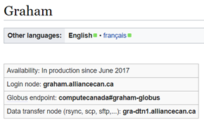
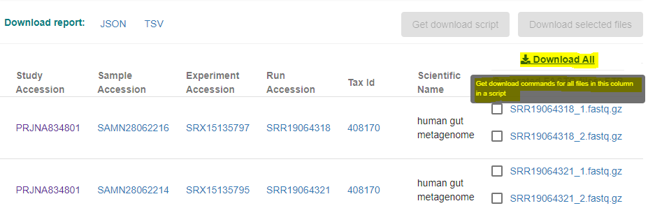

# Compute Cluster

**Dowloading reads can take a very long time.** Compute Canada has a variety of
clusters to choose from, all with varying parameters, such as the amount of
resources that can be requested. Computational nodes do not generally have
internet access, so downloads must be run interactively. It is therefore
recommended to run the downloads overnight with a stable internet connection.

Different clusters have different ways they want you to download data. For
Beluga, we can see from [the
wiki](https://docs.alliancecan.ca/wiki/B%C3%A9luga/en) that they want us to use
the login (default) node to download files, as the node name is the same.


Whereas for Graham, the node is different. These nodes can be accessed in the
same manner as the login node. Be sure to check that you are using the correct
nodes for your cluster:



**This protocol was troubleshot on Beluga and Graham**. For our lab, Graham has
a much higher storage capacity, and so it is convenient to download all the
reads from a study into this cluster and transfer files as needed (see below).
Anecdotally, Graham downloaded much faster when using Method 1 (wget), but
Graham does not have as much memory available in the login nodes and it can
therefore be difficult to install all the necessary packages for a given
pipeline. Graham is not a good choice for the other two methods listed below due
to this issue.

**You can easily transfer data between clusters using the Globus utility tool**,
so it may be convenient to download reads using Graham and then transfer files
to Beluga for processing.

# **Method 1: ENA Browser**

ENA, the European Nucleotide Archive, is a very commonly-used database for
sequencing data. If a study is listed on NCBI or another database, it is likely
to also be present in ENA. Unlike NCBI, ENA offers a very direct and convenient
downloading method using wget, which requires no installation.

Depending on file size (1-4 Gb) and internet connection, downloads took 1-20
minutes per file.

Using project **PRJNA834801** as an example, its homepage on ENA lists all
sequencing files below the project information. Click Download All to download a
.sh file that contains wget commands for every file.



The .sh file commands will be in the following format. `-nc` means 'no clobber',
meaning that it will skip the file if a file of the same name is already in the
directory. If you are redownloading files, **be sure to delete the original
copies** or use the -O parameter to overwrite it.

```{bash, eval=FALSE, warning=FALSE, include=T, results='hide'}
wget -nc ftp://ftp.sra.ebi.ac.uk/vol1/fastq/SRR190/076/SRR19064776/SRR19064776_2.fastq.gz
wget -nc ftp://ftp.sra.ebi.ac.uk/vol1/fastq/SRR190/077/SRR19064777/SRR19064777_1.fastq.gz
wget -nc ftp://ftp.sra.ebi.ac.uk/vol1/fastq/SRR190/078/SRR19064778/SRR19064778_2.fastq.gz
```

Simply go to the directory where the raw reads will be stored and then
copy/paste the contents of the .sh file into the console.

Once all files have been downloaded, check that you have the expected number of
files using the `ls -1 | wc -l` command. Remember to subtract any log files from
the final number (or simply delete them first).

## Important Notes

Firstly, the order of the wget commands is **not in alphanumerical order**. If
the order is important (separating paired reads into batches, etc), be sure to
sort the .sh file beforehand.

Secondly, it is common for the **internet connection to be lost** (unstable
connection, laptop goes into sleep mode, etc). In this case, the program will
automatically make a wget log text file. Opening it with the `nano` command will
tell you which sample was interrupted; inspection of the console output should
give the same information. Luckily, interrupted downloads can be restarted by
simply changing `-nc` to `-c` ("continue"). Then repaste the interrupted wget
command as well as any subsequent wget commands.

```{bash, eval=FALSE, warning=FALSE, include=T, results='hide'}
# The first line will continue the download from the point at which it left off.
wget -c ftp://ftp.sra.ebi.ac.uk/vol1/fastq/SRR190/076/SRR19064776/SRR19064776_2.fastq.gz
wget -nc ftp://ftp.sra.ebi.ac.uk/vol1/fastq/SRR190/077/SRR19064777/SRR19064777_1.fastq.gz
wget -nc ftp://ftp.sra.ebi.ac.uk/vol1/fastq/SRR190/078/SRR19064778/SRR19064778_2.fastq.gz
```

# Method 2: SRA Toolkit

This method works for all file sizes, does not require new installations, and is
reasonably fast.

You will need the project accession number of your desired reads. Note that the
sra-toolkit version may differ over time/clusters - run
`module spider sra-toolkit` to see the available versions.

```{bash, eval=FALSE, warning=FALSE, include=T, results='hide'}
# Files will save to this location
cd scratch/path/to/sequences

# Accession
project="PRJNA433459" # 80 samples

# Load the SRA Toolkit
module load sra-toolkit/3.0.9

# Make a list of all fastq files associated with the project, save the file accessions to a list (SRR.numbers), and download them.
# -j 2 means 2 processes at a time.
# IF YOU ARE RUNNING THIS IN A LOGIN NODE, DO NOT INCREASE J. If you're submitting it to a computational node, you can remove the "-j 2".
esearch -db sra -query $project | efetch -format runinfo > runinfo.csv
cat runinfo.csv | cut -d "," -f 1 > SRR.numbers
cat SRR.numbers | parallel -j 2 fastq-dump --split-files --origfmt --gzip {}
```

Check that you have the correct number of files afterward by running
`ls -1 /path/to/directory | wc -l`. It seems to skip files quite often for some
reason. Remember that there will be **two files for each sample** (forward and
reverse reads).

If it doesn’t download all the files, create a filtered version of SRR.numbers
and rerun the command on the missing samples:

```{bash, eval=FALSE, warning=FALSE, include=T, results='hide'}
# List of successful files
ls *.fastq.gz | sed 's/_.*//g' | sort | uniq > existing_accession_codes.txt
# Filter the original list to include accessions that aren't in the above list
grep -v -F -f existing_accession_codes.txt SRR.numbers > filtered_accession_list.txt
# Then rerun the code
module load sra-toolkit/3.0.9 # This must be run every time CC restarts
cat filtered_accession_list.txt | parallel -j 2 fastq-dump --split-files --origfmt --gzip {}
```

# Method 3: ENA File Downloader

This method is less useful because it only works for files under 5 GB, is less
easy to use, and can't be run on Cedar without requesting resources as it
requires \>15GB RAM. One benefit is that the program is able to email you once
the downloads have finished.

## Part 1: Setup (First time only)

First the ENA File Downloader program must be downloaded and installed. This can
be done in the home directory; however, if you plan to download the files as
part of a submitted job, it may be beneficial to install it directly into the
scratch folder (otherwise the cluster may have trouble accessing files in the
home directory).

```{bash, eval=FALSE, warning=FALSE, include=T, results='hide'}
wget http://ftp.ebi.ac.uk/pub/databases/ena/tools/ena-file-downloader.zip
unzip ena-file-downloader.zip
rm ena-file-downloader.zip
```

There will be two methods available to download files: FTP (standard File
Transfer Protocol) and Aspera. **Aspera is faster, but is not default and
requires an easy installation.** Like above, if you plan to download the files
as part of a submitted job, it may be beneficial to install it directly into the
scratch folder (otherwise the cluster may have trouble accessing files in the
home directory).

Optional Aspera installation:

```{bash, eval=FALSE, warning=FALSE, include=T, results='hide'}
# This version still works with sra-explorer.info.
wget https://ak-delivery04-mul.dhe.ibm.com/sar/CMA/OSA/0adrj/0/ibm-aspera-connect_4.1.3.93_linux.tar.gz
tar zxvf ibm-aspera-connect_4.1.3.93_linux.tar.gz
bash ibm-aspera-connect_4.1.3.93_linux.sh
```

IMPORTANT: if using Aspera, you will need to direct the file downloader program
to the Aspera app folder. The file path will be `.aspera/connect`, relative to
the installation folder.

## Part 2: Running the downloader

Initialize the folder where the reads will be stored and run the Java tool.

Note that the reads will not be downloaded into the same folder as they are
using the `SRA-toolkit` method: instead, the reads will be in nested folders.
For example, downloading all raw FASTQ reads from the project accession code
PRJEB17784 will result in one forward and one reverse read being downloaded for
each sample, nested as follows:
`path_to_folder/reads_fastq/PRJEB17784/ERR1912946`.

```{bash, eval=FALSE, warning=FALSE, include=T, results='hide'}
mkdir scratch/my_project
java -jar ena-file-downloader.jar
```

The Java tool will guide you through the options. If using Aspera, recall that
the path to the Aspera client is `.aspera/connect`, relative to Aspera's
installation folder.

**Note:** if the tool fails because java is not found, Java may not be
automatically loaded. This happens in the Cedar cluster and possibly some
others. Run “module spider java” in the console to see the available versions,
then run `module load java/desiredversion` before running the tool.

The following shows the console output of a successful implementation:


# Next Step

After downloading raw reads, the reads will need to be processed in order to
remove adapter sequences, human reads, and low-quality sequences. Read quality
will be tracked throughout.

[Step 2a: Checking read quality with
FastQC](https://armetcal.github.io/Bioinformatic-Tool-Wikipedia/read_filtering/fastqc.html)
