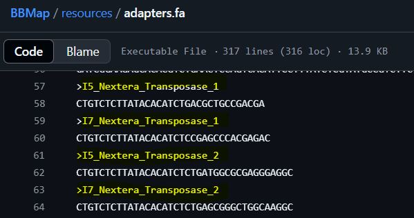
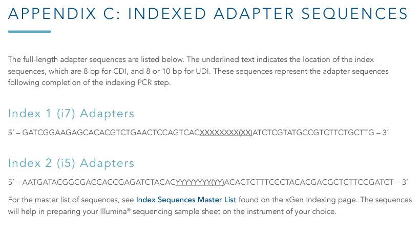
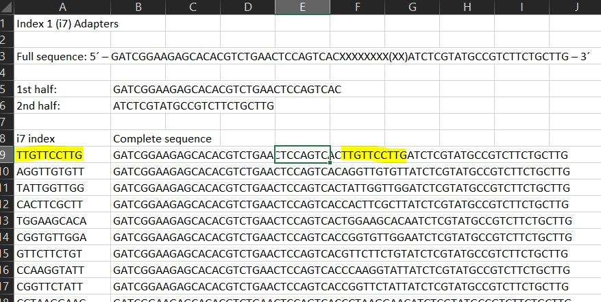
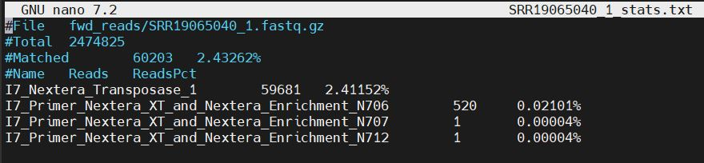

# Trimming Adapters with BBMap

When raw sequencing files are downloaded, they still contain adapter sequences
at the ends of each read. While necessary for sequencing, they contribute no
usable information and therefore serve only to contaminate the reads.

Although the adapters differ between protocols, a relatively small number of
protocols are used for the majority of sequencing runs, meaning that it is often
not necessary to know the exact adapter sequence.

BBMap contains a suite of tools that can automatically find and remove a [range
of common adapter sequences and other similar
contaminants](https://raw.githubusercontent.com/BioInfoTools/BBMap/refs/heads/master/resources/adapters.fa)
such as PhiX sequences (a type of control). Custom adapter sequences can also be
input if needed.

## Determine BBMap compatibility with your data

The list of built-in BBMap adapters can be found in the [resources folder of the
tool](https://github.com/BioInfoTools/BBMap/tree/master/resources). The default
collection is
[here](https://raw.githubusercontent.com/BioInfoTools/BBMap/refs/heads/master/resources/adapters.fa)
and will be the link referred to throughout the below tutorial.

Unfortunately, not all publicly-available datasets have adapter information
available. If present, adapter information can usually be found in the Methods
section of the original manuscript. Check the supplementary data to see if there
are any supplementary methods available, which may provide additional
information. Two examples are shown below:

### Wallen (2022): [Metagenomics of Parkinson’s disease implicates the gut microbiome in multiple disease mechanisms](10.1038/s41467-022-34667-x)

**Methods \> DNA isolation, library preparation, next-generation sequencing:**
"The sequencing libraries were prepared by using the **Illumina Nextera XT
transposase system**."

**Methods \> Bioinformatic processing of sequences \> QC of sequences:** "QC of
sequence reads was performed using BBDuk and BBSplit. In the first step of QC,
**BBDuk was used to remove Nextera XT adapter and PhiX genome contamination**,
and quality trim and filter sequences."

Here, we can see that the adapters for the **Nextera XT transposase** system are
available in the list of built-in BBMap adapters:



### Metcalfe-Roach (2024): [Metagenomic Analysis Reveals Large‐Scale Disruptions of the Gut Microbiome in Parkinson's Disease](10.1002/mds.29959)

Here the Methods section in the manuscript says "shotgun metagenomic sequencing
was performed on the **Illumina NovaSeq platform**", but does not explicitly
include library prep information.

In the Supplementary Methods, it specifies that "libraries were barcoded with
unique dual indexes using **xGen DNA Library Prep EZ** and **xGen Normalase
module** kits from Integrated DNA Technologies® (CA, USA)." A search of the
built-in adapters shows that it does not include key words such as 'xGen', and
so the kit documentation must be checked to identify the adapter sequences.

Checking the [xGen DNA Library Prep EZ
documentation](https://sfvideo.blob.core.windows.net/sitefinity/docs/default-source/protocol/xgen-dna-library-prep-ez-kit-and-xgen-dna-library-prep-ez-uni-kits-protocol.pdf?sfvrsn=57b1e007_14),
the adapter sequences for unique dual indexes (UDI) are listed in the Appendix:

{width="468"}

If we search these adapter sequences against the built-in BBMap adapters, we can
see that the areas to the left and right of the underlined indexes do indeed
match some of the other built-in adapters; unfortunately, however, the indexes
themselves are different. Clicking on the [Index Sequences Master
List](https://view.officeapps.live.com/op/view.aspx?src=https%3A%2F%2Fsfvideo.blob.core.windows.net%2Fsitefinity%2Fdocs%2Fdefault-source%2Fsupplementary-product-info%2Fidt-master-index-list.xlsx%3Fsfvrsn%3D8df8e307_6&wdOrigin=BROWSELINK)
at the bottom of the appendix and following the instructions in the **Indexing
Overview** tab, we find the full list of indexes on the **xGen Normalase UDI
Primers** tab.

It is then trivial, if somewhat annoying, to build a list of all adapter
sequences that can then be fed into BBMap. For example, the full sequences can
be assembled in Excel (as shown below) and then pasted into a text file. Format
the text file similarly to the [list of built-in BBMap
adapters](https://raw.githubusercontent.com/BioInfoTools/BBMap/refs/heads/master/resources/adapters.fa)
and upload it to your Compute Canada directory.

{width="491"}

## Running BBMap

The main function used for trimming adapters is bbduk, which is part of the
BBMap module. While BBMap is available as a module on Compute Canada, the
repository of built-in adapters will not be visible for inspection. The repo can
be manually searched (or downloaded) at the GitHub link
[here](https://github.com/BioInfoTools/BBMap/tree/master/resources) if needed.

Ideally, both the forward and reverse reads will be inputted. If using only the
forward reads, delete the `in2` and `out2` parameters.

Because the tool is computationally intensive, it will be run as a submitted
job. Navigate to the desired directory and open a new job script by writing
`nano run_bbduk.sh` into the terminal. Paste in the following script, changing
names and file paths as needed.

```{bash, eval=FALSE, warning=FALSE, include=T, results='hide'}
#!/bin/bash

#SBATCH --account=def-bfinlay   # Change bfinlay to your professor's username
#SBATCH --time=06:00:00      # Adjust time as needed
#SBATCH --cpus-per-task=10
#SBATCH --mem=15G 

# Load the dependencies
module load StdEnv/2023 bbmap/39.06

# Make the output directories
mkdir bbduk_out
mkdir bbduk_out/stats

# Trim the reads to remove (built-in) adapters and PhiX sequences
# The following is adapted from Wallen et. al (2022), as their samples are being used as an example above. Their supplementary code can be found in their paper.
The script used to carry out the task above in the HPC environment is
bbduk.sh \
 # Specify fwd and rev reads
 in=path/to/fwd/reads/file_1.fastq.gz \
 in2=path/to/rev/reads/file_2.fastq.gz \
 # Specify where the trimmed files will be saved
 out=bbduk_out/file_1.fastq.gz \
 out2=bbduk_out/file_2.fastq.gz \
 # The stats output will describe the sequences that were trimmed
 stats=bbduk_out/stats/file_stats.txt \
 # ftm, trim to a length divisible by 5; tpe, fwd and rev trimmed to same length
 # tbo, BBmerge implementation for additional trimming (pairwise reads only)
 # qtrim=rl, right and left trimming; trimq, trim to this quality score
 # minlen, remove sequences below n length
 # ref, list of possible adapters/contaminants to trim (these are built in)
 ftm=5 tpe tbo qtrim=rl trimq=25 minlen=50 ref=adapters,phix \
 # bbduk uses half available memory by default, this uses all available
 -Xmx${MAX_MEM}g
```

The stats output files can be inspected to ensure that the adapters are being
trimmed as expected. The following shows the reads that were trimmed using the
above code on sample SRR19065040_1.fastq.gz. As expected, we can see that 99% of
the trimmed sequences matched the Nextera Transposase adapter sequence, which
was used to prep the library.

{width="481"}
