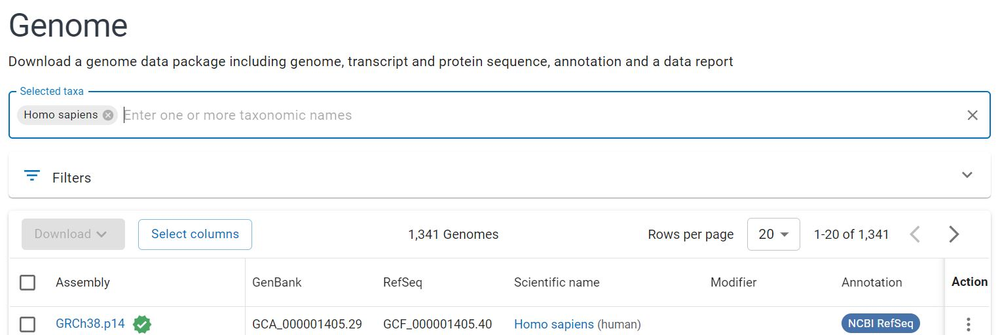
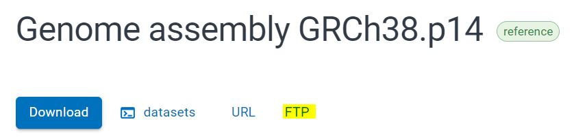

# Background

Metagenomic sequencing detects all DNA in the sample, regardless of kingdom.
While certain sample processing kits can reduce the amount of non-microbial DNA,
any **metagenomic sample from a human microbiome will contain some human reads**
(often quite a large proportion).

These reads can be recognized and removed by several available tools. The BBMap
suite, which was previously used to remove adapters, can also remove human reads
using the bbsplit tool.

**BBSplit takes each read and compares it to one or more reference genomes in
order to determine which one it matches best.** Here we can use a human
reference genome in order to determine whether each read is likely human or
other (i.e. microbial).

# Reference Genome

BBMap does not come with reference genomes, and so the representative human
genome must be downloaded. There are standardized human reference genomes
available online.

The most recent human reference genome can be found by searching the NCBI
database, where humans are classified as taxon #9606:
<https://www.ncbi.nlm.nih.gov/datasets/genome/?taxon=9606>

The search results should show the most recent reference genome at the top of
the list. It should have a green check mark.

{width="497"}

Click the Assembly link and select the FTP tab (highlighted below).

{width="380"}

A range of download options will be available. Right click on the
\_genomic.fna.gz file (genomic data in FASTA format) and copy the link.


On Compute Canada, navigate to your working directory and download the genome
using wget.

```{bash}
wget https://ftp.ncbi.nlm.nih.gov/genomes/all/GCF/000/001/405/GCF_000001405.40_GRCh38.p14/GCF_000001405.40_GRCh38.p14_genomic.fna.gz
```

# Running BBSplit

The bbsplit command will be run in two stages. First we will set the downloaded
genome as the reference genome (which outputs an 'index'), and then we will use
the indexed tool to filter out human reads.

Because the tool is computationally intensive, it will be run as a submitted
job. Navigate to the desired directory and open a new job script by writing
`nano run_bbsplit.sh` into the terminal. Paste in the following script, changing
names and file paths as needed.

```{bash}
#!/bin/bash

#SBATCH --account=def-bfinlay   # Change bfinlay to your professor's username
#SBATCH --time=06:00:00      # Adjust time as needed
#SBATCH --cpus-per-task=10
#SBATCH --mem=25G 

# Make the output directories
mkdir bbsplit_out
mkdir bbsplit_out/stats

# Load the dependencies. Change versions as needed
module load StdEnv/2023 bbmap/39.06

# Stage 1: Set ref genome. Change ref genome as needed
bbsplit.sh \
ref=GCF_000001405.40_GRCh38.p14_genomic.fna.gz \
path=bbsplit_out \
-Xmx25g # This ensures that the entire memory allotment (25G) is used

# Stage 2: remove human reads from each file
# Inputs are the adapter-trimmed files
bbsplit.sh \
in1=bbduk_out/${FILE_NAME}_R1_001.fastq.gz \
in2=bbduk_out/${FILE_NAME}_R2_001.fastq.gz \
outu1=bbsplit_out/${FILE_NAME}_R1_001.fastq.gz \
outu2=bbsplit_out/${FILE_NAME}_R2_001.fastq.gz \
path=bbsplit_out \
basename=bbsplit_out/stats/${FILE_NAME}.%_contam_#.fastq.gz \
refstats=bbsplit_out/stats/${FILE_NAME}_stats.txt \
-Xmx${MAX_MEM}g
```
