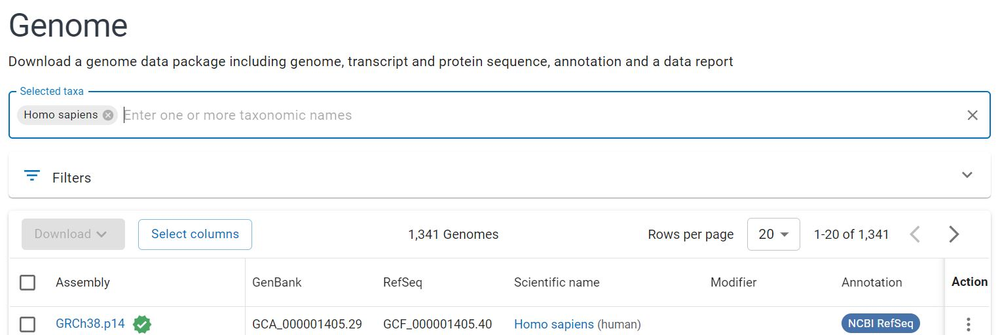
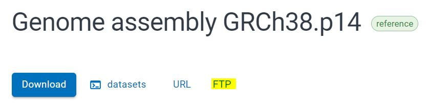
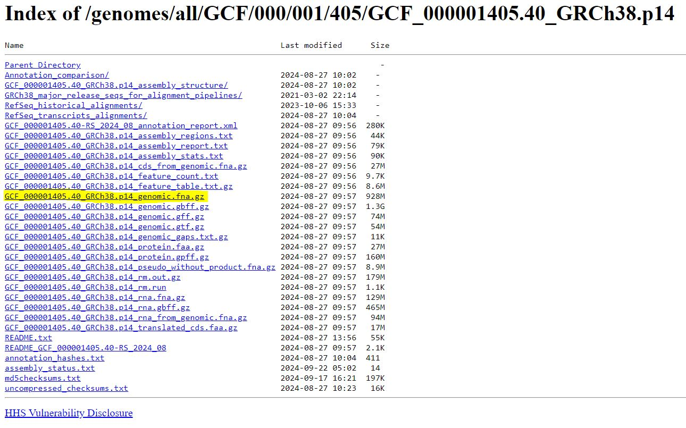

# Background

Metagenomic sequencing detects all DNA in the sample, regardless of kingdom.
While certain sample processing kits can reduce the amount of non-microbial DNA,
any **metagenomic sample from a human microbiome will contain some human reads**
(often quite a large proportion).

These reads can be recognized and removed by several available tools. The BBMap
suite, which was previously used to remove adapters, can also remove human reads
using the bbsplit tool; however, it requires a large amount of RAM and is [less
accurate than other
methods](https://link.springer.com/article/10.1186/s12859-023-05492-w).

We will use [HoCoRT (host contamination remover
tool)](https://link.springer.com/article/10.1186/s12859-023-05492-w), a newer
tool first published in 2023. Installation and implementation is simple. The
following instructions are adapted from the tool's [GitHub
repository](https://github.com/ignasrum/hocort?tab=readme-ov-file).

**HoCoRT takes each read and compares it to one or more reference genomes in
order to determine which one it matches best.** Here we can use a human
reference genome in order to determine whether each read is likely human or
other (i.e. microbial).

# Reference Genome

HoCoRT does not come with reference genomes, and so the representative human
genome must be downloaded. There are standardized human reference genomes
available online.

The most recent human reference genome can be found by searching the NCBI
database, where humans are classified as taxon #9606:
<https://www.ncbi.nlm.nih.gov/datasets/genome/?taxon=9606>

The search results should show the most recent reference genome at the top of
the list. It should have a green check mark.



Click the Assembly link and select the FTP tab (highlighted below).

{width="321"}

A range of download options will be available. Right click on the
\_genomic.fna.gz file (genomic data in FASTA format) and copy the link.



On Compute Canada, navigate to your working directory and download the genome
using wget.

```{bash, eval=FALSE, warning=FALSE, include=T, results='hide'}
wget https://ftp.ncbi.nlm.nih.gov/genomes/all/GCF/000/001/405/GCF_000001405.40_GRCh38.p14/GCF_000001405.40_GRCh38.p14_genomic.fna.gz
```

# Installing HoCoRT

HoCoRT installation is simple; however, because HoCoRT requires specific
versions of a large variety of packages, **HoCoRT must be installed into a new
environment** so that it does not overwrite any packages that are already
installed on your account. An environment is essentially a 'clean' area of your
account: anything installed in the environment is restricted to the environment,
and it ignores any programs installed outside of the environment. This allows
you to install multiple versions of various programs as needed without them
interfering with each other.

In your working directory, run the following command. This will create a new
environment called 'hocort' and will install the hocort package (+ dependencies)
using bioconda. If any errors arise, try the manual installation listed in the
[GitHub repo](https://github.com/ignasrum/hocort?tab=readme-ov-file).

```{bash, eval=FALSE, warning=FALSE, include=T, results='hide'}
conda create -n hocort -c conda-forge -c bioconda hocort
```

After installation, the environment can be activated by running
`source activate hocort`. This will be done while running a submitted job (see
next section), and does not need to be done directly after installation in the
terminal.

# Running HoCoRT

The HoCoRT command will be run in two stages. First we will create an 'index'
(read dictionary) from the downloaded human genome. The index will act as the
reference genome, where reads that either match or don't match the index will be
removed.

## Stage 1: Building the index

Building the index is more computationally intensive than running the tool and
therefore we will submit a job request. The following code will take 2-3 hours
to run. In your working directory, type `nano run_index.sh` and paste the
following:

```{bash, eval=FALSE, warning=FALSE, include=T, results='hide'}
#!/bin/bash

#SBATCH --account=def-bfinlay   # Change bfinlay to your professor's username
#SBATCH --time=03:00:00      # Adjust time as needed
#SBATCH --cpus-per-task=10
#SBATCH --mem=25G

# Create a folder to store the index files
mkdir index

# Activate the HoCoRT environment
source activate hocort

# Create the index
# bowtie2 uses bowtie2 to build the index; input is the reference genome;
# output is the FULL filepath that says where the index files will be stored.
# output must finish with a prefix used for the index files.
# For example, $SCRATCH/yourworkingdirectory/index/human adds index files called human.index.1.bt2, human.index.2.bt2, etc to the index folder created above
hocort index bowtie2 \
--input GCF_000001405.40_GRCh38.p14_genomic.fna.gz \
--output full/path/to/index/human.index
```

After the index is created, there should be several new files within a folder
called `index`. Using the human reference genome as listed above, the output
included human.index.1.bt2, human.index.2.bt2, human.index.3.bt2,
human.index.4.bt2, human.index.rev.1.bt2, and human.index.rev.2.bt2 as of
September 2024.

## Stage 2: Filtering samples

Once the index is created, the tool can be run on each set of paired reads (or
just the single-end forward reads if desired). While the processing time for
each sample is far less than the processing time for building the index, be sure
to request enough time to process all of your samples.

For one paired-end sample with 7.3 million reads of 150 bp, the program took 4.5
minutes to run using the parameters listed in the below script. For 50 samples,
this works out to 3.75 hours; be sure to add \~20-30% to the time estimate (ex.
4.5-5 hours).

In your working directory, type `nano run_hocort.sh` and paste the following:

```{bash, eval=FALSE, warning=FALSE, include=T, results='hide'}
#!/bin/bash

#SBATCH --account=def-bfinlay   # Change bfinlay to your professor's username
#SBATCH --time=05:00:00      # Adjust time as needed
#SBATCH --cpus-per-task=10
#SBATCH --mem=25G

# Make the output directory
mkdir hocort_out

# Activate the hocort environment
source activate hocort

# Run tool on paired-end, adapter-trimmed sequences
# -x gives the index (compiled in Stage 1)
# For paired sequences, give 2 inputs and 2 outputs
# --filter true will give us anything that doesn't match the index (all non-human reads in this case)
hocort map bowtie2 \
-x full/path/to/index/human.index \
-i bbduk_out/file_1.fastq.gz bbduk_out/file_2.fastq.gz \
-o hocort_out/file_1.fastq.gz hocort_out/file_2.fastq.gz \
--filter true
```

Fastq files with human reads removed will be saved to the hocort_out folder. As
usual,
[FastQC](https://armetcal.github.io/Bioinformatic-Tool-Wikipedia/read_filtering/fastqc.html)
can be run on the output samples to see how the quality attributes were
affected.

# Next Step

At this point, the reads have been trimmed to remove adapters and low-quality
end sequences, filtered to remove monomeric repeats and low-quality reads, and
all contaminating human reads have been filtered out. We have also checked read
quality using FastQC. The reads can now be used for downstream analysis!

[Step 3: Taxonomic Annotation with
MetaPhlAn4](https://armetcal.github.io/Bioinformatic-Tool-Wikipedia/annotation)
