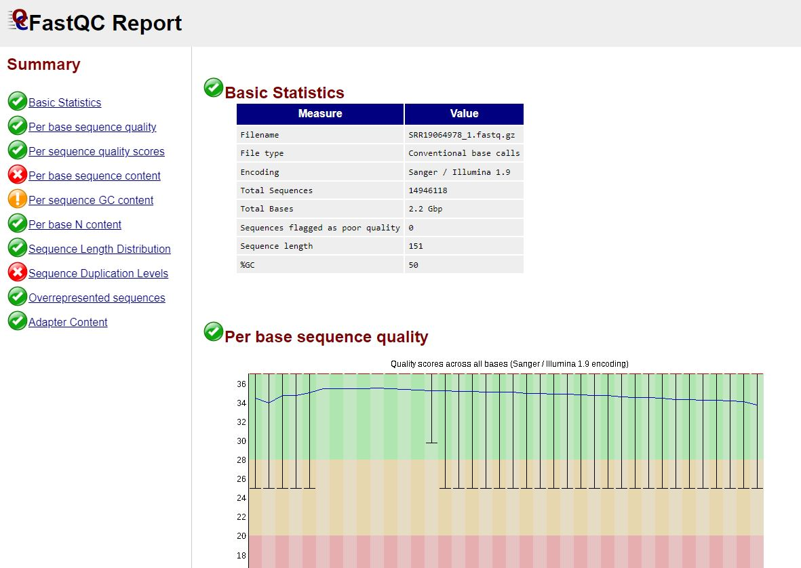

# Check Read Quality With FastQC and MultiQC

FastQC is a desktop application that can be used to visually inspect the quality
of reads stored in fastq files. However, it can also be run via the command
line, where it outputs an HTML file with summary statistics.

The website can be found [here](https://www.bioinformatics.babraham.ac.uk);
however, it is pre-installed on Compute Canada and does not need to be
separately downloaded. The tool is very modifiable, so read the documentation if
any modifications are desired. The documentation also describes the
interpretation in detail.

However, the major downside of FastQC is that each output file must be
individually inspected. Instead, we can use MultiQC, which combines the FastQC
results into a single HTML document, making it much more convenient for
high-throughput projects. This tool is not pre-installed on Compute Canada.

## Implementing FastQC

FastQC is designed to be run on fastq files. The implementation is very simple:
we simply load the FastQC module, make a list of all our fastq files, and then
feed them to the `fastqc` command. Because the command takes a long time to run
if there are more than just a few samples, FastQC should be run as a submitted
job using compute nodes.

Navigate to your sequences folder. First we create an output folder for our
FastQC results. We then initialize a new job script.

```{bash}
mkdir path/to/sequences/FastQC
nano run_fastqc.sh
```

In the text editor, paste the following script. Press Ctrl+S to save and Ctrl+X
to exit.

Note: update the module versions as needed. Use `module spider FastQC` to see
the available versions.

```{bash, eval=FALSE, warning=FALSE, include=T, results='hide'}
#!/bin/bash

#SBATCH --account=def-bfinlay   # Change bfinlay to your professor's username
#SBATCH --time=06:00:00      # Adjust time as needed
#SBATCH --cpus-per-task=10
#SBATCH --mem=15G 

# Load FastQC and its dependencies - update versions as needed.
module load StdEnv/2023 fastqc/0.12.1
# Run FastQC on all forward read files
parallel fastqc --outdir=path/to/sequences/FastQC ::: path/to/sequences/*_1.fastq.gz
```

There are two outputs per fastq file: an HTML summary and a zipped file
containing all the plots in the HTML summary.



## Implementing MultiQC

MultiQC documentation can be found [here](https://multiqc.info/docs/).

### Installing MultiQC

Installation is a multi-step process. Unfortunately, the installation is not
smooth on the Beluga cluster (I wasn't able to successfully overcome a range of
issues); however, installation on Cedar is possible.

```{bash}
module load python/3.12.4
virtualenv --no-download multiqc_virenv/env
source multiqc_virenv/env/bin/activate


# Load the Rust module
module load StdEnv/2023 rust/1.76.0
pkg install binutils
pip install multiqc
```
