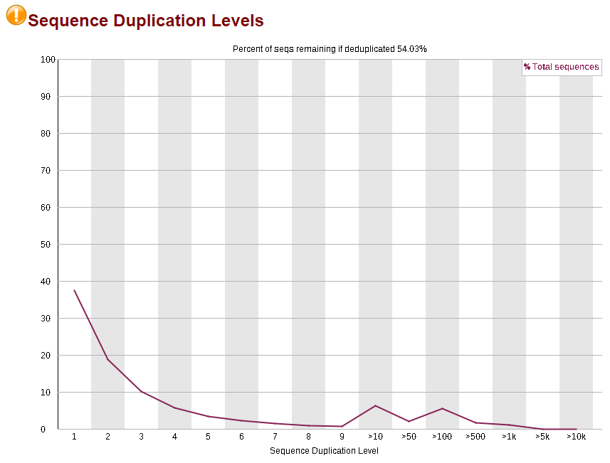
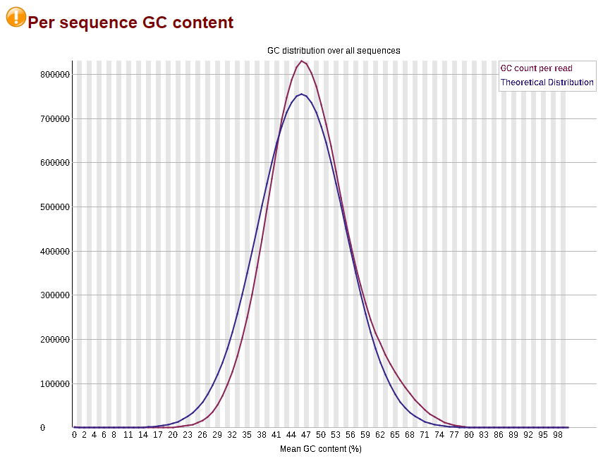
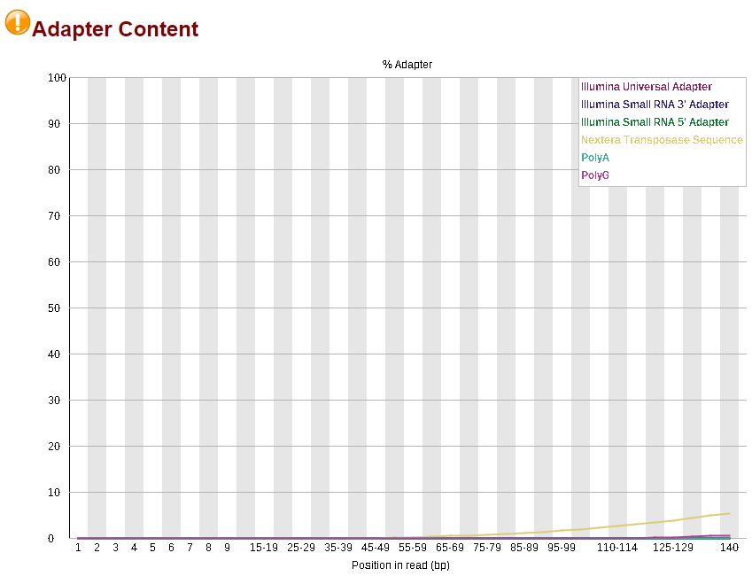

# Background

Now that we've gone through each step individually, we will put all of the steps
together and process two paired-end samples. We will assume that all
installations and downloads other than our reads are complete.

We will download two random samples from Wallen et. al's 2022 paper,
"Metagenomics of Parkinson’s disease implicates the gut microbiome in multiple
disease mechanisms".

The steps covered will include:

1.  Download reads from two samples
2.  Check the initial quality using FastQC
3.  Trim and filter reads for quality
4.  Remove human reads
5.  Check the final quality using FastQC

# Step 1: Download Reads

Note that the project accession is PRJNA834801, but we will only download two
reads for this example. It took 41 minutes to download a total of 3.7 GB -
ensure that your computer does not disconnect from the server while the code is
running. We can't submit a job since the computational nodes don't have internet
access.

## 1a. Run Code

```{bash, eval=FALSE, warning=FALSE, include=T, results='hide'}
# This will be our working directory
mkdir scratch/test_pipe2
# This is where raw sequences will be downloaded
mkdir scratch/test_pipe2/sequences
# Go to the sequences directory
cd scratch/test_pipe2/sequences

# Accession
project="PRJNA834801"

# Load the SRA Toolkit
module load sra-toolkit/3.0.9

# Make a list of all fastq files associated with the project, save the file accessions to a list (SRR.numbers), and download them.
# -j 2 means 2 processes at a time.
# IF YOU ARE RUNNING THIS IN A LOGIN NODE, DO NOT INCREASE J. If you're submitting it to a computational node, you can remove the "-j 2".
esearch -db sra -query $project | efetch -format runinfo > runinfo.csv
cat runinfo.csv | cut -d "," -f 1 > SRR.numbers

# Select first three lines (2 samples) ~~~~~~~~~~~~~~~~~
# Note: overwriting doesn't work.
head -n 3 SRR.numbers > SRR.numbers.2
#~~~~~~~~~~~~~~~~~~~~~~~~~~~~~~~~~~~~~~~~~~~~~~~~~~~~~~~

# Download reads
cat SRR.numbers.2 | parallel -j 2 fastq-dump --split-files --origfmt --gzip {}
```

## 1b. Outputs

The following code is printed to the console. First there were several error
messages, which is an artifact of the way SRR.numbers.2 is formatted; however,
the code then runs normally for the two samples.

{width="322"}

Inspecting our sequences folder using ls -l \*, we see that four fastq.gz files
have been downloaded, with each one being 1.2-1.6 GB. (Because the reads are
split into forward/reverse when downloaded, the combined size is larger than the
actual download.)

{width="457"}

# Step 2: Check Quality

## 2a. Run Code

First we return to our project directory, then open a new script:

```{bash, eval=FALSE, warning=FALSE, include=T, results='hide'}
# Return to the project main folder
cd ..
# Make the new folder and initialize a script
nano run_fastqc.sh
```

In the script, paste the following and then hit Ctrl+S and Ctrl+X to save and
exit. Note that the time is designed for only four read files (two samples).

```{bash, eval=FALSE, warning=FALSE, include=T, results='hide'}
#!/bin/bash

#SBATCH --account=def-bfinlay   # Change bfinlay to your professor's username
#SBATCH --time=01:00:00      # Adjust time as needed
#SBATCH --cpus-per-task=10
#SBATCH --mem=15G 

# Make the folder that will store all fastqc outputs
# This folder will also be used when we run fastqc at the end.
mkdir fastqc_out

# Load FastQC and its dependencies - update versions as needed.
module load StdEnv/2023 fastqc/0.12.1
# Run FastQC on all forward read files
parallel fastqc --outdir=fastqc_out ::: sequences/*.fastq.gz
```

Then run the script using `sbatch run_fastqc.sh`.

## 2b. Outputs

In our fastqc_out folder, two files are generated for each input file. One is an
HTML page summarizing the quality metrics, and the other is a zip file
containing all the images within the HTML file.

The HTML files can be downloaded from Compute Canada using the Globus online
tool and opened in your browser. **Both samples fail certain tests and have
warnings in others.**

Both samples fail the **Per Base Sequence Content** test. This artifact is
common in sequencing libraries when observed in the beginning of the read.
Notably, this is a technical bias, but trimming is not recommended as they still
represent real DNA and trimming does not seem to improve read quality (see [this
link](https://www.bioinformatics.babraham.ac.uk/projects/fastqc/Help/3%20Analysis%20Modules/4%20Per%20Base%20Sequence%20Content.html)
for more info).

{width="446"}

Both samples have warnings in **Sequence Duplication Levels**, meaning that
non-unique sequences make up \>20% of the total reads. Ideally, most reads
should have no duplication (left side of the plot). These may be contaminants
such as primers, adapters, etc, or might point to PCR overamplification when
prepping the library. See [this
link](https://www.bioinformatics.babraham.ac.uk/projects/fastqc/Help/3%20Analysis%20Modules/8%20Duplicate%20Sequences.html)
for more info.

{width="435"}

Sample 1 (SRR19065033) also shows a warning for **GC content** - it is not as
normal as expected. However, the deviation is somewhat minor. Spikes may
indicate the presence of specific contaminants, but no spikes are apparent
here. See [this
link](https://www.bioinformatics.babraham.ac.uk/projects/fastqc/Help/3%20Analysis%20Modules/5%20Per%20Sequence%20GC%20Content.html)
for more info.

{width="431"}

Sample 2 shows a warning for **Adapter Content**. Notably, it identifies the
type of adapter detected: the Nextera Transposase Sequence adapter. This matches
the adapters described in the Wallen et. al paper. See [this
link](https://www.bioinformatics.babraham.ac.uk/projects/fastqc/Help/3%20Analysis%20Modules/10%20Adapter%20Content.html)
for more info.

{width="426"}

Overall, the QC has only demonstrated the necessity of several filtering steps
that are part of the regular pipeline (ex. adapter trimming). No other problems
with the library are apparent.

# Step 3: Trim and Filter

## 3a. Run Code

Start a new script in the project directory by entering `nano run_bbduk.sh`. In
the script, paste the following and then hit Ctrl+S and Ctrl+X to save and exit.
Note that the time is designed for only four read files (two samples). Run the
script using `sbatch run_bbduk.sh`.

```{bash, eval=FALSE, warning=FALSE, include=T, results='hide'}
#!/bin/bash

#SBATCH --account=def-bfinlay   # Change bfinlay to your professor's username
#SBATCH --time=01:00:00      # Adjust time as needed
#SBATCH --cpus-per-task=10
#SBATCH --mem=15G 

# Load the dependencies
module load StdEnv/2023 bbmap/39.06 java/21.0.1

# Make the output directories
mkdir bbduk_out
mkdir bbduk_out/stats

# Trim and filter, all in one step
# First we read in all the unique sequencing file names, then pull out 
# the sample names, and then read them through our bbduk.sh pipeline.
# {} acts as a placeholder for the sample names.
ls *_1.fastq.gz | sed 's/_1.fastq.gz//' | parallel bbduk.sh \
in=sequences/{}_1.fastq.gz \
in2=sequences/{}_2.fastq.gz \
out=bbduk_out/{}_1.fastq.gz \
out2=bbduk_out/{}_2.fastq.gz \
outm=bbduk_out/{}_removed.fastq.gz \
stats=bbduk_out/stats/{}_stats.txt \
tpe tbo qtrim=rl trimq=25 maq=25 minlen=50 ref=adapters,phix \
-Xmx15g
```

## 3b. Outputs
